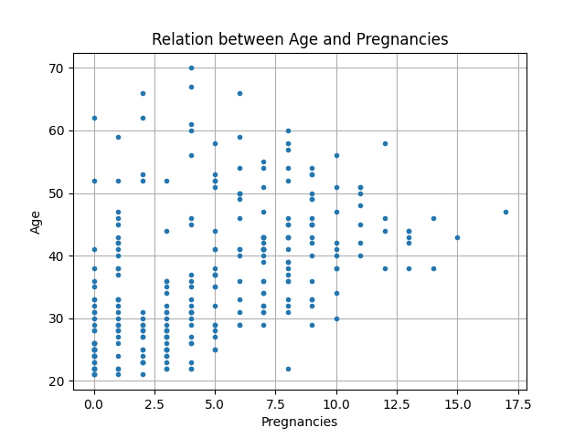
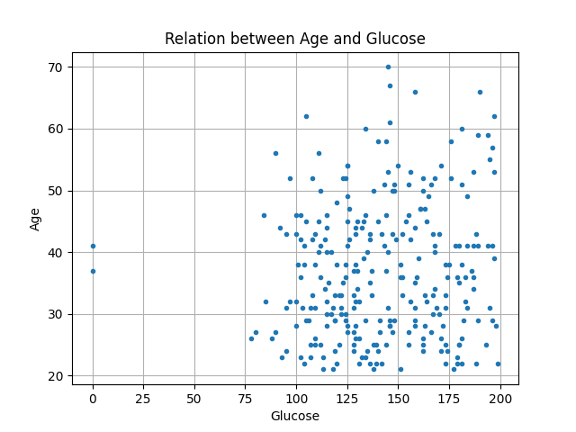
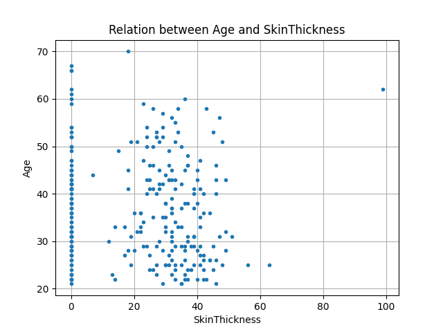
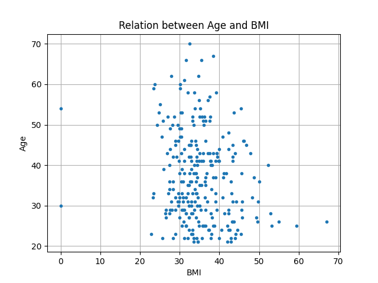

# ⚕ Diabetes Age Prediction - Linear Regression :chart_with_upwards_trend:
- Algoritmo de Machine Learning utilizado para prever a idade que mulheres acima dos 21 anos provenientes da India podem desenvolver diabetes baseado nos seguintes biomarcadores:
  - Números de gravidez
  - Glicose do sangue
  - Pressão arterial
  - Largura da pele
  - Nível de insulina
  - IMC

[]()
[]()
[]()
[]()
[]()
[]()
---

## :beginner: Tecnologias utilizadas:
- **Pandas**
- **Numpy**
- **Matplotlib**

## :pencil: Explicação
Com este repositório você poderá entender um pouco melhor como a técnica de Regressão Linear utilizada em Machine Learning funciona e pode ser aplicada aos problemas reais do dia a dia. Como exemplo foi utilizada uma base de dados pré-existente e real.

O intuito da análise realizada foi tentar prever com que idade uma pessoa pode desenvolver diabetes baseada em seus biomarcadores, este estudo foi dirigido na India com mulheres acima de 21 anos.A fim de credibilizar os pesquisadores deixarei ao final da explicação o link para acesso ao arquivo original.

Caso você já tenha algum conhecimento prévio do que se trata o conceito base, sugiro que pule para a etapa de explicação do código e dos dados encontrados.


### :chart_with_upwards_trend: ***Regressão Linear:***
> É uma técnica estatística utilizada para encontrar a relação entre variáveis, em machine learning é possível encontrar a relação entre os atributos e rótulos de um conjunto de dados.

- Na Regressão Linear utilizamos alguns conceitos técnicos que nos auxiliam a encontrar a corelação entre os nossos dados e a melhorar análises, tornando os dados confiáveis:
  1. Equação de Regressão Linear
  2. Perda
  3. Gradiente descendente
  4. Hiperparâmetros
1. :heavy_division_sign: **Equação de Regressão Linear:**
> $y'= b + w_1 * x_1 + w_2 * x_2 + w_n * x_n ...$
  - Onde:
    - b: viés
    - w: peso
    - x: atributo de entrada
    - y': saída
  - Caso sejam dados com vários atributos, adicionamos um peso para cada tipo de atributo, como representado por $w_n * x_n$
2. :chart_with_downwards_trend: **Perda:**
> Representa uma forma de quantificarmos o quão longe o algoritmo está nas suas predições com os dados reais, ou seja, o quanto está errando.
  - _Grupo L1:_ Tipo utilizado para quantificar perdas onde no conjunto de dados temos uma relação de dados mais agrupados uns aos outros
    - *Loss L1*: $∑|actualValue-predictedValue|$
    - *Mean Absolute Error*: $(1/N) * ∑|actualValue-predictedValue|$
  - _Grupo L2:_ Tipo utilizado para quantificar perdas onde no conjunto de dados sua relação é mais espalhada ou quando queremos que nosso algoritmo esteja próximo desses valores, é uma perda mais punitiva ao quão fora da curva os resultados previstos estão dos rótulos reais.
    - *Loss L2*: $∑(actualValue-predictedValue)²$
    - *Mean Square Error*: $(1/N) * ∑(actualValue-predictedValue)²$
3. :arrow_heading_down: **Gradiente descendente:**
> Técnica iterativa que faz cálculos e ajusta o viés e os pesos até encontrar valores com perdas muito parecidas, ou seja, quando a perda não muda mais de maneira significativa com o tempo das iterações. Podemos dizer que este loop de iteração é onde o treinamento é feito.
  - Está técnica consiste em iniciar com viés e pesos com valores próximos de zero, o usuário escolhe um número de iterações e de acordo com ele o modelo irá tentar encontrar um melhor valor para os pesos e vies que irá se basear em reduzir a perda, o objetivo é reduzir ao máximo possível a perda.
  - Este conceito funciona como uma parábola, onde o seu pico máximo é denominado convergência (ponto em que o modelo não tem mudanças significativas em suas perdas). Quando o modelo chega na convergência falamos que ele convergiu e chegamos em nosso objetivo.
4. :earth_americas: **Hiperparâmetros:**
> Variáveis que nos possibilitam controlar diferentes aspectos do treinamento, temos:
  - _Taxa de aprendizado:_ velocidade com que o modelo atualiza os pesos, valor pré-definido para controlar como o modelo irá aprender. Nele existem particularidades que precisamos nos atentar como:
    - Não deixar o valor muito alto, pois se não os resultados são muito inconstantes e o modelo por consequência nunca irá convergir.
    - Não deixar o valor muito baixo, pois quando menor for maior será o tempo para o modelo convergir.
    - Por tando, é necessário realizar testes e utilizar o valor que mais se adeque ao modelo.
  - _Tamanho do Lote:_ número de amostrar que o exemplo irá processar antes de atualizar os pesos. Pode ser pouco prático utilizar apenas um exemplo por vez antes de atualizar os pesos, por tanto podemos fazer isso de maneira mais eficiente e colocar um número de exemplos por iteração, definindo assim lotes para que o modelo processe os pesos antes de atualizar. Temos duas formas de fazer esse processo:
    - Utilizando o Grandiente descendente estocástico (SGD), onde utilizamos apenas um exemplo por iteração escolhido de forma aleatória. Este resulta em resultados ruidosos.
    - Utilizando o Grandiente descendente estocástico com mini-lotes, onde utilizamos um número de amostras por iteração escolhidas de forma aleatória antes da atualização dos pesos. Os resultados apresentam menos ruido.
  - _Eras:_ É a definição de quantas vezes o modelo irá processar todos os exemplos do conjunto, então se dizermos que Eras = 1, o modelo processou todas as amostras uma vez. Quanto maior o número de Eras melhor o modelo pode ficar, porém o tempo de treinamento também será maior.

## :rocket: Explicação do Código:
Com o fluxo do código abaixo:
```
DiabetesAgePrediction
  └──files
  │    └─diabetes.csv
  └──test
  │   └─test.py
  └──linearRegression.py
  └──.env
  └──requirements.txt
```
### files:
- diabetes.csv: Arquivo utilizado como fonte de dados de treinamento do modelo.
### test:
- test.py: Algoritmo que irá rodar o código para que sua saída seja analisada. Por padrão, o método irá gerar um gráfico de Loss vs Epochs, onde será realizada uma análise de como a perca decai ou aumenta com o tempo de treinamento com as amostras.
### linearRegression.py:
- Algoritmo principal, aqui serão realizados todos os cálculos, definições de parâmetros e toda a estrutura funcional do modelo.
### .env:
- Arquivo com a informação do caminho do arquivo com a fonte de dados.
### requirements.txt:
- Documento com todas as bibliotecas utilizadas no código, para adicioná-las com facilidade dê o comando:
```
pip install -r requirements.txt
```
## :computer: Implementação Prática:
Para implementar o código e realizar seus testes localmente, clone o repositório em um pasta com:
```
git clone https://github.com/RyanBrittes/DiabetesAgePrediction.git
```
Entre no diretório em que salvou o repositório:
```
cd local_salvo
cd DiabetesAgePrediction
cd test
```
Estando na pasta **test**:
```
python test.py
```
## Análise preliminar sobre a fonte de dados utilizados para uma melhor condução do treinamento do modelo:
Antes de começar a trabalhar com os dados, foi feita uma análise para saber como os biomarcadores e o fator alvo **Age** se relacionam:



_Relação entre Age e Pregnance_



_Relação entre Age e Glucose_


_Relação entre Age e Blood Pressure_



_Relação entre Age e Skin Thickness_


_Relação entre Age e Insulin_



_Relação entre Age e BMI_


É possível observar que os dados estão com grau de desagrupamento elevado, portando no algoritmo foi utilizado a função de perda quadrática que tenta prever resultados fora da curva.

## Resultados encontrados:
Realizando as devidas ponderações nos parâmetros para encontrar a convergência do algoritmo, foram encontraos os seguintes valores:
- Taxa de aprendizado (self.lr): 0.00001
- Eras (self.epochs): 100000
- Tamanho do lote (self.batchSize): 30
- Taxa de amostras teste (self.rateTest): 0.1
- Taxa de amostras de treinamento: 0.9
- Perca final encontrada (lossValue): 93.190424
- Viés encontrado (self.bias): 6.74128
- Pesos encontrados (self.weight)
  - Peso 'Pregnancies': 1.38677763
  - Peso 'Glucose': 0.07766161
  - Peso 'BloodPressure': 0.18223321
  - Peso 'SkinThickness': -0.09267285
  - Peso 'Insulin': 0.00763439
  - Peso 'BMI': 0.02430139
 
Gráfico que representa a perca ao longo do treinamento do algoritmo:


### Amostra de resultados de testes realizados com a predição do modelo em comparativo com o valor real do conjunto de dados:

**Amostra 01:**
- Pregnancies: 7.0
- Glucose: 161.0
- BloodPressure: 86.0
- SkinThickness: 0.0
- Insulin: 0.0
- BMI: 30.4
- Previsão: 45.363057985329284 | Real: 47

**Amostra 02:**
- Pregnancies: 2.0
- Glucose: 90.0
- BloodPressure: 68.0
- SkinThickness: 42.0
- Insulin: 0.0
- BMI: 38.2
- Previsão: 25.932288649696076 | Real: 27

**Amostra 03:**
- Pregnancies: 4.0
- Glucose: 125.0
- BloodPressure: 80.0
- SkinThickness: 0.0
- Insulin: 0.0
- BMI: 32.3
- Previsão: 37.35968045679937 | Real: 27

## Conclusão
Com o resultado encontrado do algoritmo foi possível identificar que com o conjunto de dados utilizado, existe uma certa correlação que pode nos dar um indicativo previsão baseado em biomarcadores feitos por uma análise clínica com que idade uma mulher acima dos 21 anos, proveniente da India, pode desenvolver diabetes. Porém, é importante observar que a perca resultante final foi elevada, e em um cenário médico onde números como estes são de extrema importância pois quanto antes um problema for identificado e resolvido melhor, o contrário resulta em cenários catastróficos, então há de se melhorar em muitos pontos, seja com dados mais robustos ou com a utilização de outros algoritmos.

> Este algoritmo tem apenas o intuito de analisar um conjunto de dados e mostrar os resultados encontrados ao treinar um modelo com Regressão Linear. Por tanto não é recomendado utilizar este algoritmo como base de um diagnóstico, procure um especialista na área antes de tirar qualquer conclusão.

## Documentação adicional:
Caso queira encontrar uma documentação adicional das tecnologias utilizadas, seguem os arquivos:
| Tecnologia | Doc   |
|---------------|----------------|
| Pandas   | [Pandas - Doc](https://pandas.pydata.org/docs/)   |
| Numpy | [Numpy - Doc](https://numpy.org/doc/stable/)    |
| Matplotlib | [Matplotlib - Doc](https://matplotlib.org/stable/users/index) |
| Base de dados  |  [Kanggle](https://www.kaggle.com/datasets/uciml/pima-indians-diabetes-database)  |

## Considerações finais:
Estou disponível para caso hajam dúvidas ou dicas de melhorias, abaixo encontre os meios de contato comigo:
- [](https://www.linkedin.com/in/ryanbrittes/)
