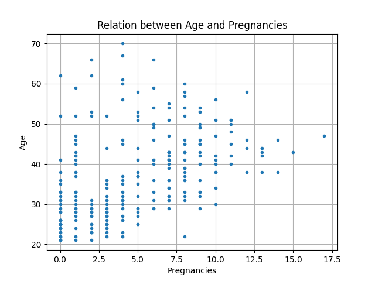
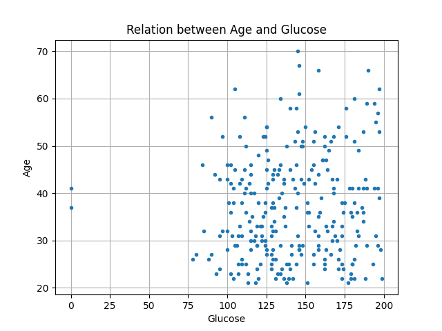
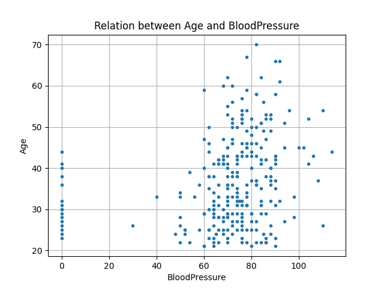
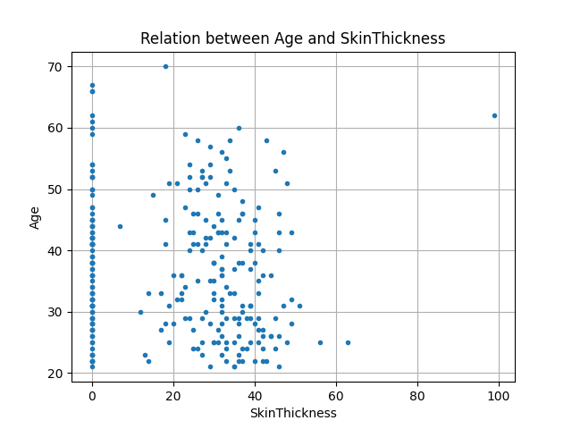
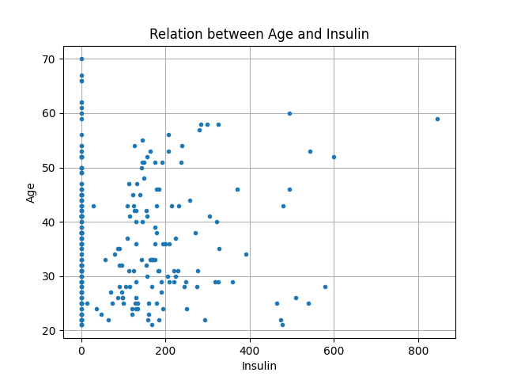
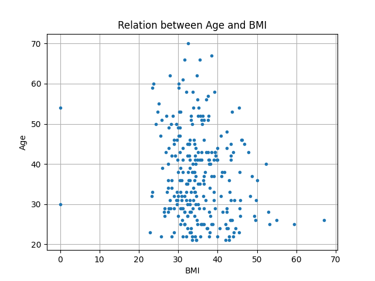

## Análise preliminar sobre a fonte de dados utilizados para uma melhor condução do treinamento do modelo:
Antes de começar a trabalhar com os dados, foi feita uma análise para saber como os biomarcadores e o fator alvo **Age** se relacionam:

_Relação entre Age e Pregnance_

_Relação entre Age e Glucose_

_Relação entre Age e Blood Pressure_

_Relação entre Age e Skin Thickness_

_Relação entre Age e Insulin_

_Relação entre Age e BMI_

É possível observar que os dados estão com grau de desagrupamento elevado, portando no algoritmo foi utilizado a função de perda quadrática que tenta prever resultados fora da curva.